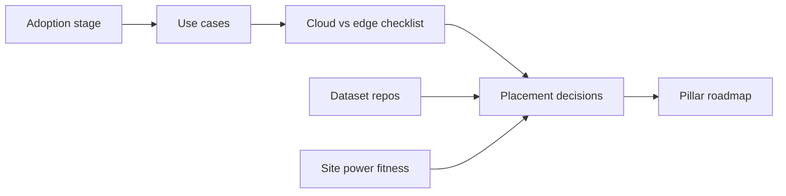

# HingeEdge

**Source:** `ai-in-iot/ai-at-the-edge-whitepaper/`
**Domain:** `ai-iot`
**One-liner:** Helps enterprises decide cloud vs edge for AI/IoT use cases—with latency/bandwidth/autonomy checklists, adoption-stage roadmaps, and dataset readiness—so real-time OT decisions are not stranded waiting on distant data centers.
**Wedge:** Manufacturing, logistics, utilities, and healthcare teams that invested in AI/ML (Forrester: 48% NA by 2018) but still send everything to cloud while 60–73% of enterprise data stays untapped and site decisions need milliseconds.
**Positioning:** ai-at-the-edge placement advisor. Avnet whitepaper: IoT spend categories >$40B; cloud latency (~0.82 ms per 100 miles) blocks real-time; edge hive architecture enables response, reliability, security, lower bandwidth cost; power/wiring constraints matter; checklist contrasts cloud vs edge; adoption levels Passive→Pioneer with five-step path (use case→datasets→train→insights→operational AI) covering technology, data, people, compliance.

## Market research synthesis

### Thesis from source

AI+IoT aims at actionable insights for production, efficiency, and cost. Market readiness is high, but infrastructure choice determines whether AI can decide in real time. Cloud aggregation remains valuable for complex/historical analytics; distance introduces latency unsuitable for manufacturing, medical imaging, autonomous driving. Edge shifts collect/store/analyze locally—hive of smaller computers vs one big center—yielding real-time response, better reliability under poor connectivity, enhanced security (data stays local; anomaly detection at edge), lower bandwidth cost. Predictive maintenance and supply-chain optimization are exemplar use cases. Power: battery IoT often cannot sustain continuous AI; wired power and stronger gateways needed as chipsets grow (neuromorphic cited). Checklist: choose edge when real-time decisions, near-instant transmission, local bandwidth preference, and downtime sensitivity dominate. Journey: Passives, Experimenters, Investigators, Pioneers; partner-led five steps and four pillars (technology, data, people, compliance).

### Buyer & economic model

- **Primary buyer:** VP Digital Transformation / OT+IT architecture lead in manufacturing, logistics, utilities, healthcare systems.
- **Users:** solution architects, data leads, plant managers, compliance, partner managers.
- **Budget owner / value metric:** AI program + connectivity budget. Metrics: % use cases with documented placement, latency incidents avoided, untapped dataset activation rate, time Passive→Operational AI.
- **Competing status quo:** default-to-cloud; vendor PoCs without checklist; AI theater without datasets.

### Domain constraints

- **Regulatory / trust / safety:** regional compliance pillar; emissions/health examples need auditable decisions.
- **Data sensitivity:** plant emissions, patient monitoring, supply-chain positions.
- **Change-management realities:** Passives/Experimenters need staged roadmap, not a forklift edge rebuild.

## Business requirements

- BR-1: Every use case completes a cloud-vs-edge checklist (realtime, latency, bandwidth, autonomy).
- BR-2: Placement decisions record rationale and revisit triggers (e.g., new latency SLA).
- BR-3: Dataset repositories must exist before algorithm implementation stage gates open.
- BR-4: Adoption stage (Passive→Pioneer) is assessed and drives allowed next actions.
- BR-5: Power/reliability constraints of candidate edge sites are captured (battery vs wired).
- BR-6: Predictive maintenance and supply-chain patterns are available as starter templates.
- BR-7: Compliance recommendations are region-scoped.
- BR-8: People/training plans are required before “Operational AI” status.
- BR-9: Hybrid designs (cloud historical + edge realtime) are first-class, not either/or only.
- BR-10: Commercial packaging prices by use cases under advisement and sites assessed.
- BR-11: Untapped data inventories track activation progress (Forrester gap).
- BR-12: Executive roadmap export covers technology, data, people, compliance pillars.

## User stories

Canonical user stories live in sibling [USER_STORIES.md](USER_STORIES.md).

## System design

### Overview

HingeEdge assesses adoption stage, registers use cases and datasets, runs cloud-vs-edge checklists, records placement decisions (including hybrid), tracks power/site fitness, and emits pillar roadmaps to operational AI.

### Actors & boundaries

- **Actors:** architects, data leads, plant/ops, compliance, executives, implementation partners.
- **Trust boundary:** advisory and governance; does not execute inference on OT networks directly.
- **Human-in-the-loop points:** placement approval, stage reassessment, Operational AI declaration.

### Core capabilities

1. **Adoption staging** — Passive→Pioneer.
2. **Use case registry** — AI/IoT opportunities.
3. **Placement checklist** — cloud vs edge criteria.
4. **Placement decisions** — including hybrid.
5. **Dataset readiness** — repos & activation.
6. **Site power fitness** — battery/wired constraints.
7. **Roadmap builder** — tech/data/people/compliance.
8. **Template library** — PdM, supply chain, etc.

### Conceptual data

- **Primary entities:** OrganizationProfile, UseCase, ChecklistResult, PlacementDecision, DatasetRepo, EdgeSite, Roadmap, AdoptionStageEvent.
- **Critical events:** checklist completed, placement approved, dataset gated, stage changed, operational AI declared.
- **Retention / audit needs:** placement rationales retained for compliance and post-incident review.

### Integrations (conceptual)

- **Systems of record:** IoT platforms, data catalogs, CMDB/sites, GRC.
- **Upstream signals:** latency measurements, bandwidth costs, inventory of unused data stores.
- **Downstream actions:** architecture tickets, partner SOWs, executive packs.

### High-level architecture

### Success metrics

- **Leading:** % use cases with checklist; dataset gate pass rate; stage progression rate.
- **Lagging:** realtime decision incidents from wrong placement; time to Operational AI; bandwidth cost delta.

## OpenAPI skeleton

Canonical HTTP surface lives in sibling `openapi.yaml`. Summarize here:

- **Base path:** `/v1/...`
- **Auth:** API key and/or Bearer JWT (operator)
- **Resource groups:** UseCases, Checklists, Placements, Datasets, Roadmaps
