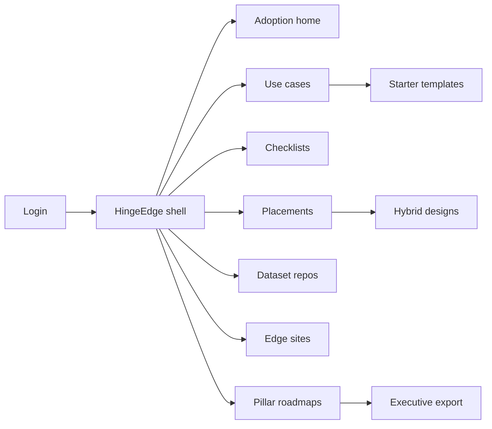
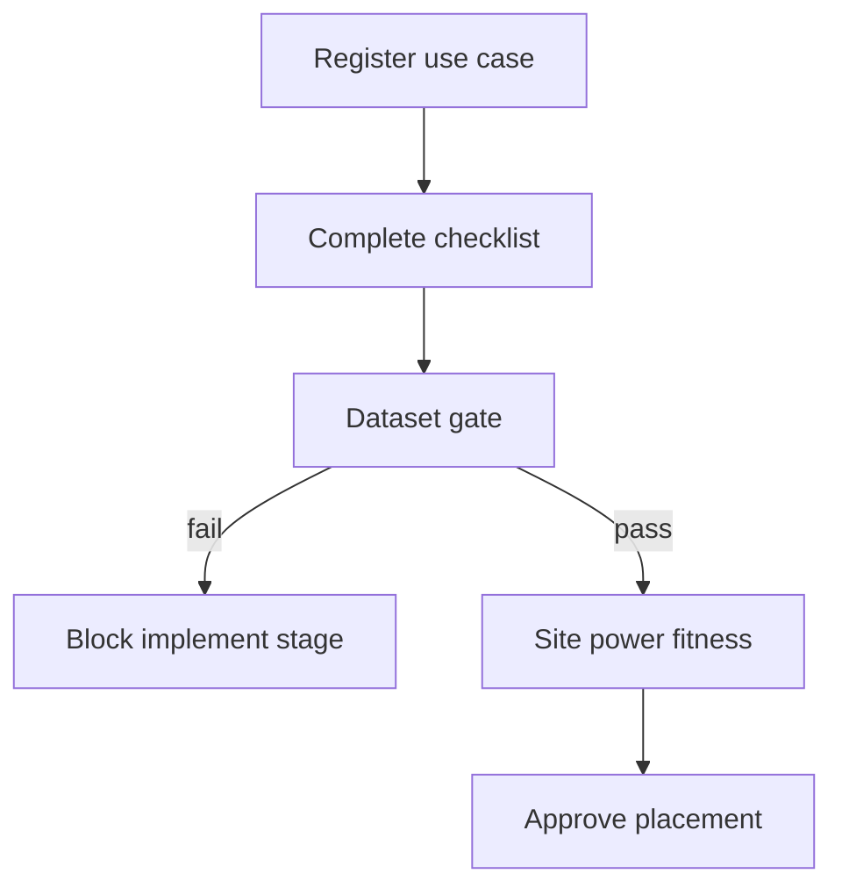

# HingeEdge — Web app

**Product:** [PRODUCT.md](./PRODUCT.md)
**Primary surface:** Edge placement advisory console (architects, data leads, plant/ops, compliance under one HingeEdge shell)
**Secondary surfaces:** Executive pillar-roadmap PDF/export viewer; partner-limited use-case workspace (read/write scoped)
**Design thesis:** HingeEdge is a hinge between cloud gravity and plant-floor milliseconds—not another IoT telemetry dashboard. The metaphor is an architecture hinge plate: every use case must swing through a forced cloud-vs-edge checklist, dataset gate, and site power fitness check before placement locks. Visual language is cool concrete-cyan and industrial amber on deep charcoal: edge-placed decisions feel bolted; cloud-default without checklist feels provisional. The brand wordmark sits as a quiet hinge stamp on every placement and roadmap screen so OT/IT owners always know whose placement doctrine they are trusting.

## UX research synthesis

### Category peers (best-in-class)

- **AWS IoT Greengrass / SiteWise:** Device/site hierarchy, edge component deploy, industrial asset models. Steal: site-first fitness cards (power, connectivity); reject Greengrass’s deploy-centric chrome where HingeEdge’s job is placement *decision* before runtime.
- **Azure IoT Edge / Arc:** Hybrid cloud–edge as first-class topology. Steal: hybrid objects (cloud historical + edge realtime) as named placements; reject Azure’s portal sprawl of dozens of blades for a single checklist flow.
- **Siemens Industrial Edge / MindSphere:** OT-aware stage gates and partner delivery. Steal: staged maturity (Passive→Pioneer) driving allowed actions; reject marketing “digital twin theater” without dataset readiness.
- **Collibra / Alation (data catalog UX):** Inventory of unused assets with activation progress. Steal: untapped-data % as a first-class KPI; reject pure glossary UX that ignores latency/bandwidth checklist criteria.

### Patterns to adopt / reject

- **Adopt:** Forced checklist before cloud default; placement rationale + revisit triggers; dataset repo gate blocking “implement algorithm”; adoption stage as chrome that constrains next actions; battery vs wired on edge site cards; PdM/supply-chain starter templates; region-scoped compliance on roadmaps; hybrid placement as a first-class type; four-pillar executive export.
- **Reject:** Default-to-cloud wizard with optional checklist; vanity “AI readiness score” without pillars; purple insight glow; dashboard-of-everything home; forklift “rip out cloud” messaging for Passives; card grids of static sensor charts as the product.

### Trust, density, and workflow constraints from PRODUCT.md

Passives and Experimenters need staged roadmaps, not forklift edge rebuilds (BR-4, exception story): UI must offer supervised pilot paths without faking Pioneer maturity. Dataset repositories must exist before algorithm stage gates open (BR-3)—empty promises blocked visually. Plant emissions, patient monitoring, and supply-chain positions are sensitive (BR-7): compliance is region-scoped on the same roadmap as tech/data/people. Placement rationales retained for post-incident review (BR-2). Partners see only assigned use cases (admin story). Advisory trust boundary: HingeEdge never pretends to execute OT inference.

## Information architecture

### Nav model

### Roles → default home

| Role | Default home | Why |
|------|--------------|-----|
| Solution architect | Use cases — checklist incomplete | Force placement before cloud default (BR-1) |
| Data lead | Dataset repos — gate status | Block empty-promise builds (BR-3, BR-11) |
| Plant manager | Edge sites — power fitness | Battery sensors not tasked with continuous AI (BR-5) |
| Compliance officer | Pillar roadmaps — region scope | Geography-matched recommendations (BR-7) |
| Executive sponsor | Adoption home — Passive→Pioneer | Stage progression and Operational AI declaration (BR-4, BR-8) |
| Implementation partner | Assigned use cases only | Confidentiality of strategic roadmap |

### Cross-links to OpenAPI resources

| Nav area | OpenAPI tags / resources |
|----------|---------------------------|
| Use case registry, templates | UseCases |
| Cloud-vs-edge checklist | Checklists |
| Placement decisions / hybrid | Placements |
| Dataset readiness / untapped inventory | Datasets |
| Pillar roadmaps; org adoption stage | Roadmaps (+ adoption-stage) |

## Screen inventory

### Adoption home

- **Purpose:** Answer “where are we on Passive→Pioneer, and what next actions are allowed?” in one composition.
- **Entry:** Post-login for sponsors/architects; stage change alerts.
- **Layout regions:** Brand chrome; stage continuum (Passive / Experimenter / Investigator / Pioneer); allowed-actions panel gated by stage; KPI strip (% use cases with checklist, dataset gate pass rate, untapped activation %); alerts (revisit triggers, people-plan missing for Operational AI).
- **Primary actions:** Reassess stage; open blocked use case; export executive pack.
- **Empty / loading / error:** Empty = start org profile + first stage assessment; error = retry with request id.
- **BR / story ties:** BR-4, BR-8, BR-11, BR-12.

### Use case registry

- **Purpose:** Register AI/IoT opportunities and track checklist/placement/dataset status per case.
- **Entry:** Architect default; from templates.
- **Layout regions:** Filterable table (stage allowed?, checklist, placement type, dataset gate, site fitness); detail drawer with rationale summary; partner assignment indicator.
- **Primary actions:** Create use case; apply PdM/supply-chain template; open checklist; request supervised pilot path.
- **Empty / loading / error:** Empty = “add first use case or start from template”; validation on missing buyer context.
- **BR / story ties:** BR-1, BR-6, BR-10; architect stories.

### Cloud-vs-edge checklist

- **Purpose:** Force realtime, latency, bandwidth, and autonomy criteria before any cloud default.
- **Entry:** Use case → Checklist; incomplete filter on home.
- **Layout regions:** Criteria form (realtime decision need, latency SLA, local bandwidth preference, downtime sensitivity); distance/latency callout (e.g., unsuitable when distant DC); result badge (edge / cloud / hybrid lean); notes for PEMS-like examples.
- **Primary actions:** Complete checklist; save draft; generate placement draft from result.
- **Empty / loading / error:** Incomplete = cannot open placement approve; conflicting answers highlighted.
- **BR / story ties:** BR-1; architect “500 miles away” story.

### Placement decision

- **Purpose:** Lock cloud, edge, or hybrid placement with rationale and revisit triggers.
- **Entry:** After checklist; Placements nav.
- **Layout regions:** Placement type selector (hybrid as first-class); rationale editor; revisit triggers (new latency SLA, site power change); linked checklist + datasets + sites; approval status.
- **Primary actions:** Approve placement; set revisit trigger; open hybrid split (historical cloud / realtime edge); export ADR-style record.
- **Empty / loading / error:** Blocked if dataset gate red or site fitness missing for edge/hybrid; error on concurrent edit.
- **BR / story ties:** BR-2, BR-9; architect hybrid story.

### Dataset readiness

- **Purpose:** Prove repositories exist and track activation of the 60–73% untapped data gap before algorithm stage.
- **Entry:** Data lead default; use case → Datasets.
- **Layout regions:** Repo list bound to use cases; activation progress bar; gate status (pass/fail for implement stage); inventory of untapped stores; sensitivity tags.
- **Primary actions:** Register repo; mark activated; fail gate with reason; link to catalog integration.
- **Empty / loading / error:** Empty = “no repos — algorithm stage locked”; gate fail banner explicit.
- **BR / story ties:** BR-3, BR-11; data lead stories.

### Edge site power fitness

- **Purpose:** Capture battery vs wired and reliability constraints so continuous AI is not assigned to weak sites.
- **Entry:** Plant manager default; placement → Sites.
- **Layout regions:** Site cards (power mode, gateway strength, connectivity reliability); fitness score vs use-case AI load; warnings for battery + continuous inference.
- **Primary actions:** Add site; update power mode; attach to placement; flag unfit.
- **Empty / loading / error:** Empty = register first plant/site from CMDB import.
- **BR / story ties:** BR-5; plant manager story.
- **Mobile notes:** Site fitness readable on tablet on the floor; editing power mode supported; full roadmap editing desktop-preferred.

### Starter templates

- **Purpose:** Seed predictive maintenance and supply-chain patterns without blank-page architecture.
- **Entry:** Use case create → Templates.
- **Layout regions:** Template gallery (PdM, supply chain, healthcare monitoring, emissions); preview of checklist defaults and hybrid suggestion; apply wizard.
- **Primary actions:** Apply template; customize criteria; save as org template.
- **Empty / loading / error:** N/A beyond loading skeleton.
- **BR / story ties:** BR-6.

### Pillar roadmap builder

- **Purpose:** Emit technology / data / people / compliance roadmap to Operational AI with region scope.
- **Entry:** Compliance/executive; from adoption home.
- **Layout regions:** Four-pillar board; region selector; people/training plan requirement flag; Operational AI declaration control; partner-visible slice.
- **Primary actions:** Edit pillar items; attach people plan; declare Operational AI (blocked without people plan); export executive pack.
- **Empty / loading / error:** Missing people plan = coral block on Operational AI; region unset = compliance pillar warning.
- **BR / story ties:** BR-7, BR-8, BR-12.

### Supervised pilot path

- **Purpose:** Let Experimenter sponsors run a learning pilot without claiming Pioneer maturity.
- **Entry:** Exception CTA from adoption home or use case.
- **Layout regions:** Pilot scope; stage-safe allowed actions; success criteria; exit to full checklist/placement.
- **Primary actions:** Start pilot; convert to full use case; cancel with note.
- **Empty / loading / error:** Pioneer orgs see path as optional, not required.
- **BR / story ties:** Exception story; BR-4.

### Partner scoped workspace

- **Purpose:** Limit partner access to assigned use cases so strategic roadmaps stay confidential.
- **Entry:** Partner login.
- **Layout regions:** Assigned use-case list only; no org-wide adoption chrome; SOW-linked placement view.
- **Primary actions:** Update checklist notes; upload site evidence; request architect review.
- **Empty / loading / error:** Empty = no assignments message.
- **BR / story ties:** Admin story.

## Key flows

1. **Place a realtime use case** — register use case → complete checklist → dataset gate → site fitness → approve edge or hybrid placement; failure: cloud lean with realtime=true forces architect override note.

2. **Hybrid split** — checklist leans mixed → create hybrid placement (cloud historical / edge realtime) → bind repos + sites → revisit triggers set (BR-9).

3. **Stage progression** — assess Passive→Experimenter→… → unlock actions → people plan attached → declare Operational AI (BR-4, BR-8).

4. **Untapped data activation** — inventory unused stores → register repos → track % activated → gate flips green (BR-11).

5. **Executive export** — four pillars + region compliance → PDF/CSV pack for board / partner SOW (BR-12).

## Design system

### Tokens (CSS variables)

- `--color-ink: #E8EEF2` — primary text
- `--color-charcoal-950: #0B1014` — app ground
- `--color-charcoal-900: #151C24` — panels
- `--color-charcoal-700: #2E3C4A` — dividers
- `--color-hinge: #2EC4B6` — edge-placed / checklist complete (concrete cyan)
- `--color-hinge-dim: #1A6F68` — cyan on dark
- `--color-amber: #E8A317` — provisional / revisit trigger
- `--color-coral: #E85D4C` — dataset gate fail / unfit site
- `--color-steel: #8A9BAB` — secondary labels
- `--color-brand: #9FD4CC` — HingeEdge wordmark accent
- `--font-display: "Freight Sans", "Source Sans 3", sans-serif` — titles and stage labels
- `--font-mono: "IBM Plex Mono", monospace` — placement ids, latency figures, site codes
- `--space-1`…`--space-8`: 4px scale
- `--radius-sm: 4px`; `--radius-md: 8px` — bolted industrial, not pill-heavy
- `--motion-hinge: 220ms cubic-bezier(0.2, 0.8, 0.2, 1)` — placement type swing
- `--motion-gate: 160ms ease-out` — dataset gate flip
- `--motion-revisit: 260ms ease-in-out` — amber pulse on trigger due
- Atmosphere: soft concrete grain + cool cyan edge light along left chrome; no stock “smart factory” photo wallpaper in console.

### Typography & brand

- Display for stage continuum and placement type; mono for latency SLAs, site ids, export hashes.
- Brand wordmark left of shell on every placement and roadmap view; never subordinated to “Dashboard.”
- Login/marketing shell: brand hero; one headline (“Place AI where milliseconds matter”); one CTA — no IoT spend vanity stats in first viewport.

### Do / don’t

- **Do:** Force checklist before placement approve; show hybrid as equal to cloud/edge; battery warning on continuous-AI sites; region on compliance pillar; stage-gated actions.
- **Don’t:** Purple AI glow; optional checklist; sensor live-map as home; editable placement rationale after incident lock without audit; emoji stage badges.

### Accessibility & domain trust cues

- Contrast AA+ on hinge/amber/coral; placement type also labeled in text (“Edge”, “Hybrid”).
- Live regions announce dataset gate flips and revisit-trigger due dates.
- Focus order: use case → checklist → datasets → sites → placement → roadmap.
- Placement export includes machine-readable rationale for compliance review.

## Component patterns

- **AdoptionStageRail** — Passive→Pioneer continuum with allowed-actions lock.
- **PlacementChecklistForm** — realtime/latency/bandwidth/autonomy forced fields.
- **HybridPlacementSplit** — cloud historical vs edge realtime panes.
- **DatasetGateBanner** — blocks implement stage when repos missing.
- **SitePowerFitnessCard** — battery/wired + ai-load warning (interaction container).
- **RevisitTriggerChip** — amber due state for SLA/power changes.
- **PillarRoadmapBoard** — tech/data/people/compliance with region scope.
- **UntappedActivationMeter** — % of unused data inventory activated.

## Out of scope for v1 web

- Edge runtime deploy/orchestrator (Greengrass-class); OT historian live dashboards; native mobile plant apps; auto-procurement of gateways; multi-cloud cost FinOps deep suite; white-label reseller portal beyond partner scoped workspace.
